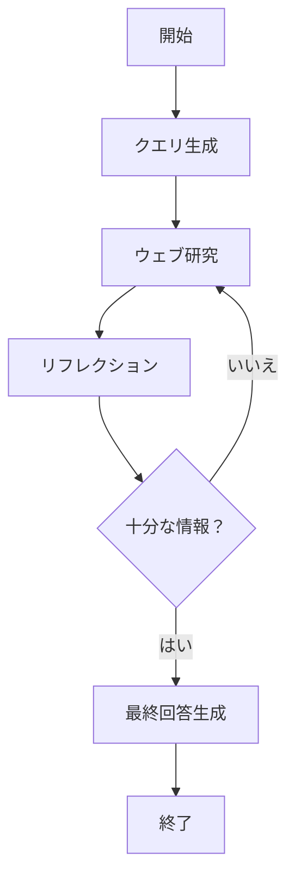

# Deep Research Clone - Backend

LangGraph を使用した AI 研究エージェントのバックエンド実装です。

## 概要

このプロジェクトは、複数の AI エージェントが協調して動作し、ウェブ検索を通じて包括的な研究レポートを生成するシステムです。OpenAI の LLM と Tavily Search API を活用しています。

## ディレクトリ構造

```
backend/
├── src/
│   ├── api/           # FastAPI アプリケーション
│   │   └── app.py     # メインAPIエントリーポイント
│   ├── config/        # 設定管理
│   │   └── configuration.py  # LangGraph実行時設定
│   ├── graphs/        # LangGraphグラフ定義
│   │   └── research_graph.py # 研究エージェントグラフ
│   ├── nodes/         # グラフノード実装
│   │   ├── base_node.py          # ノード基底クラス
│   │   ├── query_generation.py   # クエリ生成ノード
│   │   ├── research.py           # ウェブ研究ノード
│   │   └── finalization.py      # 最終回答生成ノード
│   ├── prompts/       # プロンプトテンプレート
│   │   ├── query.py   # クエリ生成プロンプト
│   │   ├── research.py # リフレクションプロンプト
│   │   └── answer.py  # 最終回答プロンプト
│   ├── schemas/       # Pydanticスキーマ（LLM構造化出力用）
│   │   └── schemas.py # SearchQueryList, Reflection
│   ├── states/        # グラフ状態定義
│   │   ├── base.py    # OverallState（メイン状態）
│   │   └── search.py  # WebSearchState（並列検索用）
│   └── utils/         # ユーティリティ関数
│       ├── citation_utils.py  # 引用処理
│       ├── message_utils.py   # メッセージ処理
│       ├── url_utils.py       # URL処理
│       └── date_utils.py      # 日付フォーマット
├── examples/          # 使用例
│   └── cli_research.py # CLIでの研究実行例
├── pyproject.toml     # プロジェクト設定
└── README.md          # このファイル
```

## 各コンポーネントの役割

### グラフアーキテクチャ



### ノードの責務

1. **QueryGenerationNode**: ユーザーの質問から検索クエリを生成
2. **WebResearchNode**: Tavily API を使用してウェブ検索を実行
3. **ReflectionNode**: 収集した情報の分析と知識ギャップの特定
4. **ResearchEvaluationNode**: 研究の継続/終了を判定
5. **FinalizationNode**: 収集した情報から最終回答を生成

### 状態管理

- **OverallState**: グラフ全体で共有される主要な状態
- **WebSearchState**: 並列検索タスク用の軽量な状態

### スキーマ

- **SearchQueryList**: クエリ生成の構造化出力
- **Reflection**: リフレクション分析の構造化出力

## 開発環境

### 必要なツール

- Python 3.11+
- [uv](https://github.com/astral-sh/uv) - パッケージ管理
- [ruff](https://github.com/astral-sh/ruff) - リンター/フォーマッター
- [mypy](https://mypy-lang.org/) - 型チェック

### セットアップ

```bash
# 依存関係のインストール（開発ツールも含む）
uv sync
```

### 環境変数

`.env`ファイルに以下を設定：

```env
OPENAI_API_KEY=your_openai_api_key
TAVILY_API_KEY=your_tavily_api_key
```

## 開発ルール

### コーディング規約

1. **型ヒントの使用**
   - すべての関数に型ヒントを付ける
   - 複雑な型は`typing`モジュールを使用

```python
from typing import List, Dict, Optional

def process_data(items: List[str]) -> Dict[str, int]:
    """データを処理する関数"""
    pass
```

2. **docstring の記述**
   - すべてのクラスと関数に docstring を記述
   - 日本語での説明を推奨

```python
def search_web(query: str) -> List[Dict[str, str]]:
    """ウェブ検索を実行する。

    Args:
        query: 検索クエリ

    Returns:
        検索結果のリスト
    """
    pass
```

3. **エラーハンドリング**
   - 適切な例外処理を実装
   - カスタム例外は最小限に

### 開発フロー

1. **コードフォーマット**

```bash
# フォーマットのチェック
ruff format --check .

# 自動フォーマット
ruff format .
```

2. **リンティング**

```bash
# リントエラーのチェック
ruff check .

# 自動修正可能なエラーを修正
ruff check --fix .
```

3. **型チェック**

```bash
# 型チェックの実行
mypy src/
```

## アーキテクチャの原則

1. **単一責任の原則**: 各ノードは 1 つの明確な責務を持つ
2. **依存性の注入**: 設定は外部から注入される
3. **状態の不変性**: 各ノードは新しい状態を返し、既存の状態を変更しない
4. **エラーの透明性**: エラーは適切にログに記録され、ユーザーに伝達される

## トラブルシューティング

### よくある問題

1. **API キーエラー**

   - `.env`ファイルが正しく設定されているか確認
   - 環境変数が正しく読み込まれているか確認

2. **型チェックエラー**

   - `mypy`の`ignore_missing_imports`設定を確認
   - 必要に応じて型スタブをインストール

3. **インポートエラー**
   - `PYTHONPATH`に`src`ディレクトリが含まれているか確認
   - `uv sync`で依存関係を再インストール

## 貢献

1. 機能追加や修正を行う前に、既存のコードスタイルを確認
2. すべてのコードは`ruff`と`mypy`のチェックをパスする必要がある
3. 新しいノードを追加する場合は、`BaseNode`を継承
4. プロンプトは`prompts/`ディレクトリに配置

## ライセンス

[プロジェクトのライセンスをここに記載]
